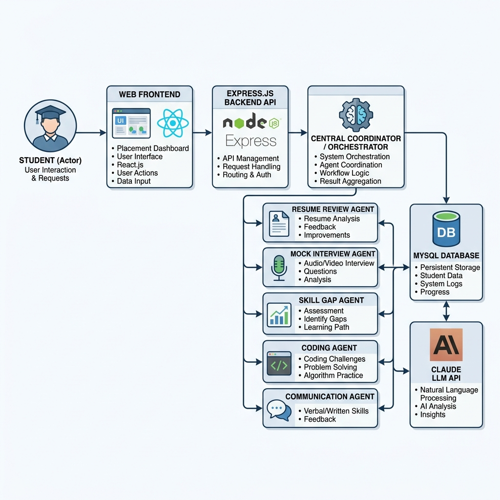

# Multi-Agent Smart Placement Preparation System

## Overview
The Multi-Agent Smart Placement Preparation System is an intelligent, full-stack evaluation dashboard built to assess student job-readiness. Coordinated by a central Orchestrator agent, the system launches 5 specialist AI agents in parallel to review a student's resume ATS compatibility, mock technical/behavioral interview answer, skill gaps, coding syntax correctness, and professional communication tone. The results are merged into a single Placement Readiness Score and an actionable, personalized 30-day roadmap.

## Architecture
Below is the system architecture showing the data flow from the Student Actor through the Express Orchestrator to the specialist LLM agents:



## Tech Stack
* **Frontend**: Vite + React + Tailwind CSS
* **Backend**: Express.js (Node.js)
* **LLM API**: Anthropic Claude API (model: `claude-3-5-sonnet-latest`)
* **Database**: MySQL or PostgreSQL via Sequelize ORM; SQLite is available only for local development fallback
* **Deployment**: Render for the backend, Vercel for the frontend
* **Auth**: JWT-based secure student sessions

## Prompt Engineering
All 6 agent prompts (the orchestrator and the 5 specialists) are documented in detail at [/docs/prompt-engineering.md](./docs/prompt-engineering.md).
Key prompt engineering concepts enforced:
1. **Role Alignment**: Personas are clearly defined for each specialized task (e.g. Recruiter, Career Coach, Code Auditor).
2. **Few-Shot Examples**: Each agent has system prompts seeded with expected input-output examples to enforce structure.
3. **Chain-of-Thought (CoT)**: Evaluator agents are structured to fill out a `"reasoning"` block in the JSON output, thinking step-by-step before determining ratings.
4. **Formatting Constraints**: Absolute output constraints are specified to enforce raw JSON structure and prevent conversational noise.

## Setup Instructions

### 1. Prerequisites
* [Docker](https://www.docker.com/products/docker-desktop/) and Docker Compose installed.
* An Anthropic API Key (Claude).

### 2. Environment Configuration
Create a `.env` file for the backend using [backend/.env.example](backend/.env.example) as a template. Update the following values:
```env
JWT_SECRET=any_custom_secure_secret_key
ANTHROPIC_API_KEY=your_actual_anthropic_api_key
DATABASE_URL=your_render_or_managed_database_url
```

For the frontend, set [frontend/.env.example](frontend/.env.example) in Vercel with your Render backend URL:
```env
VITE_API_URL=https://your-backend.onrender.com/api
```

### 3. Local Development
Run the Docker Compose command to build and launch the MySQL database and Node backend:
```bash
docker-compose up --build
```
Once healthy:
* Backend API Documentation/Health: `http://localhost:5000/status`
* Frontend: run `npm install` and `npm run dev` inside the [frontend](frontend) folder, then set `VITE_API_URL=http://localhost:5000/api`

---

## Deployment Instructions

### Render backend
1. Create a new Web Service from the [backend](backend) folder.
2. Use the Dockerfile in [backend/Dockerfile](backend/Dockerfile).
3. Set environment variables from [backend/.env.example](backend/.env.example), especially `DATABASE_URL`, `JWT_SECRET`, and `ANTHROPIC_API_KEY`.
4. Point the service to a persistent Render database or another managed database URL.

### Vercel frontend
1. Create a new Vercel project from the [frontend](frontend) folder.
2. Set `VITE_API_URL` to the deployed Render backend URL plus `/api`.
3. Build output stays Vite-native, so no Docker or Nginx setup is needed.

---

## API Endpoints

| Endpoint | Method | Authentication | Description |
|---|---|---|---|
| `/api/auth/register` | POST | None | Creates a new student profile |
| `/api/auth/login` | POST | None | Authenticates and returns a secure JWT |
| `/api/auth/me` | GET | JWT | Verifies session token and returns active student profile |
| `/api/orchestrator/evaluate` | POST | JWT | Runs all 5 specialist agents in parallel, updates scores |
| `/api/agents/resume-review` | POST | JWT | Checks resume cache by hash, calculates ATS compliance |
| `/api/agents/mock-interview/question`| GET | JWT | Generates behavioral/technical question for target role |
| `/api/agents/mock-interview` | POST | JWT | Grades student's STAR answer, stores evaluation report |
| `/api/agents/skill-gap` | POST | JWT | Performs gap analysis on current skills vs role demands |
| `/api/agents/coding-eval/problems`| GET | JWT | Retrieves the list of backend mock coding exercises |
| `/api/agents/coding-eval` | POST | JWT | Evaluates JS syntax, space/time complexity, correctness |
| `/api/agents/communication` | POST | JWT | Audits written grammar, vocabulary, clarity, and tone |
| `/api/student/:id/report` | GET | JWT | Parameterized SQL query joining all 6 reports for student |
| `/api/student/:id/history` | GET | JWT | Retrieves placement score progression over time |
| `/api/admin/student-scores` | GET | JWT | Lists all students' grades (Admin view, filterable/sortable) |

---

## Deployment Notes
* The backend is structured for Render with a production Dockerfile and env-driven database configuration.
* The frontend remains a standard Vite React app for direct Vercel deployment.
* The frontend no longer relies on Docker or Nginx.
