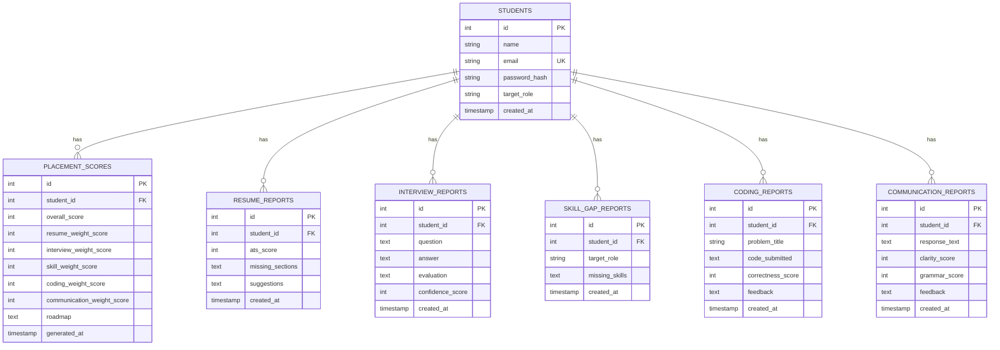

# Multi-Agent Smart Placement Preparation System
## Architectural Documentation

This document explains the database schema, the multi-agent orchestration architecture, and the request flow of the placement evaluation system.

---

## 1. Database Schema Design (PostgreSQL / SQLite)

The database layers are implemented using **Sequelize ORM** with support for PostgreSQL (production) and SQLite (automatic zero-config local development). Inside the code, all queries are parameterized to prevent SQL Injection exploits.



---

## 2. Multi-Agent Orchestrator Pipeline

The central system employs a multi-agent structure containing **1 Central Orchestrator** and **5 Specialized AI Agents**.

```mermaid
flowchart TD
    Request([POST /api/orchestrator/evaluate]) --> Auth[JWT Auth Middleware]
    Auth --> Multer{Multer handles PDF?}
    Multer -- Yes --> PDFParse[pdf-parse extracts text]
    Multer -- No --> Orchestrator[Orchestrator Agent]
    PDFParse --> Orchestrator
    
    subgraph Specialist Agents (Parallel Run)
        Orchestrator --> A2[Resume Review Agent]
        Orchestrator --> A3[Mock Interview Agent]
        Orchestrator --> A4[Skill Gap Agent]
        Orchestrator --> A5[Coding Eval Agent]
        Orchestrator --> A6[Communication Agent]
    end
    
    A2 --> A2DB[(Write resume_reports)]
    A3 --> A3DB[(Write interview_reports)]
    A4 --> A4DB[(Write skill_gap_reports)]
    A5 --> A5DB[(Write coding_reports)]
    A6 --> A6DB[(Write communication_reports)]
    
    A2DB & A3DB & A4DB & A5DB & A6DB --> Merge[Orchestrator Merges Scores]
    
    Merge --> ScCalc[Compute Placeability Score]
    ScCalc --> RoadGen[Claude: Generate 30-day Roadmap]
    RoadGen --> DBPS[(Write placement_scores)]
    DBPS --> Response([JSON Return: Score + Roadmap])
```

### Specialist Agents Overview
1. **Resume Review Agent**: Inspects candidate resumes to check ATS configurations, lists missing segments, and creates actionable suggestions.
2. **Mock Interview Agent**: Interviews behavioral + technical aspects based on the target role, grading structural clarity and candidate confidence.
3. **Skill Gap Agent**: Cross-references present credentials with the target market role demands, outputting prioritized missing items.
4. **Coding Evaluation Agent**: Reviews algorithm structures, assessing logic correctness, time/space complexity, and syntax hygiene.
5. **Communication Agent**: Screens structural flow, grammatic mechanics, and vocal/written tone confidence.

---

## 3. Placement Scoring Formula

The overall score is computed inside the orchestrator using weighted contributions:
* **Technical (40%)**:
  * *Coding Evaluation correctness*: **25%**
  * *Skill Gap completeness*: **15%**
* **Communication**: **20%**
* **Resume (ATS) Score**: **15%**
* **Coding Consistency**: **15%** (derived dynamically from the count of active student code submissions)
* **Mock Interview**: **10%**

$$\text{Readiness Score} = (S_{\text{resume}} \times 0.15) + (S_{\text{interview}} \times 0.10) + (S_{\text{skill}} \times 0.15) + (S_{\text{coding\_eval}} \times 0.25) + (S_{\text{consistency}} \times 0.15) + (S_{\text{communication}} \times 0.20)$$

All scoring queries (e.g. unified reports and global admin scores) utilize parameterized raw queries.

---

## 4. Efficiency and Caching Strategy

To deliver fast, reliable, and cost-effective evaluations, the system implements the following performance patterns:

1. **Concurrently Executed Agents (`Promise.all`)**
   - The orchestrator fires calls to all 5 specialist agents in parallel via `Promise.all()`. This caps the total evaluation time to the speed of the single slowest agent (~5-8s) rather than sequential execution (~25-30s).

2. **Hash-Based Evaluation Caching**
   - Before requesting Claude API analysis, the **Resume Review Agent** computes a SHA-256 hash of the resume text. Similarly, the **Coding Evaluation Agent** computes a SHA-256 hash of the submitted code.
   - The database is queried for a match on the student's ID and the computed hash (`resume_hash` / `code_hash`).
   - If a matching report is found, the system skips calls to the AI model and directly reads the cached evaluation from the database.

3. **Network Resiliency (Timeout & Auto-Retry)**
   - Each Claude API request is wrapped with a **30-second timeout** utilizing `Promise.race`.
   - If a request fails or times out, a **single automatic retry** is initiated immediately.
   - If the second attempt fails, the system gracefully falls back to structured mock data to prevent blocking the entire placement scoring pipeline.

